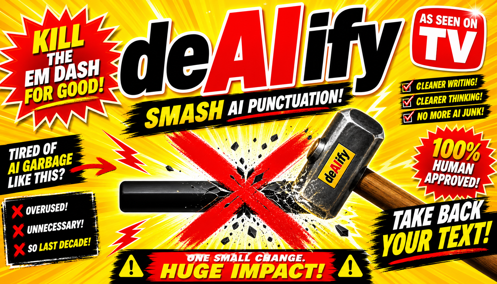

<p align="center">
  
</p>

```
     _          _    ___  _  __       
    | |        / \  |_ _|(_)/ _|_   _ 
  __| | ___   / _ \  | | | | |_| | | |
 / _` |/ _ \ / ___ \ | | | |  _| |_| |
| (_| |  __// ___ _\|___|_|_|  \__, |
 \__,_|\___\_/   \_/            |___/ 
```

# deAIify

### An OpenClaw Plugin

---

## HI, BILLY MAYS HERE FOR deAIify!

ARE YOU TIRED of your LLM dropping em-dashes into every single response -- making your automated tweets look like a 19th century periodical and TANKING your engagement?

Does your AI assistant write like it swallowed a Victorian typewriter? Do your Slack bots sound like they're narrating a Dickens novel? Is every sentence interrupted by those PRETENTIOUS little horizontal lines that SCREAM "a robot wrote this"?

**Well BILLY MAYS HERE with deAIify!**

The ONLY OpenClaw plugin that doesn't just find-and-replace your dashes like some AMATEUR HOUR regex script. No sir. deAIify intercepts the ENTIRE RESPONSE and makes the LLM RESTRUCTURE IT. Like a disappointed parent returning a C-minus essay. "Do it again. DO IT RIGHT."

---

## WHAT DOES IT DO?

- **CATCHES** em-dashes (U+2014) and en-dashes (U+2013) BEFORE they reach your users
- **INTERCEPTS** the response via `before_agent_reply` -- the hook fires BEFORE delivery
- **SENDS IT BACK** to the LLM with a restructuring prompt that says "REWRITE THAT WITHOUT THE DASHES, PAL"
- **VERIFIES** the rewrite is sane (word count and length checks, because we're not animals)
- **SHIPS THE CLEAN VERSION** -- actual restructured sentences, not some find-and-replace hackjob

This isn't character substitution. This is a FULL ARCHITECTURAL INTERVENTION. We don't put a band-aid on the dash. We send the whole response back to the FACTORY.

---

## v3: THE FORMULA, PERFECTED

**v1 was wrong:** string replacement swaps characters but leaves broken grammar. "Things like this -- might result in" becomes "Things like this. might result in" (lowercase m after period, BROKEN).

**v2 tried harder** but kept a regex-first mode that caused the same problem.

**v3 is the one.** LLM-first, every time. No regex fallback. No character swaps. JUST PROPER SENTENCES.

```
  ┌─────────────┐     ┌──────────────────┐     ┌─────────────────┐
  │  LLM writes │────>│  before_agent_    │────>│  Dashes found?  │
  │  a response │     │  reply hook       │     │                 │
  │             │     │  intercepts it    │     │  YES: REWRITE   │
  └─────────────┘     └──────────────────┘     │  NO: SHIP IT    │
                                               └────────┬────────┘
                                                        │ (dashes found)
                                                        v
                      ┌──────────────────┐     ┌─────────────────┐
                      │  runEmbedded     │────>│  Verification   │
                      │  PiAgent sends   │     │  gate: word     │
                      │  restructuring   │     │  count + length │
                      │  prompt to LLM   │     │  checks pass?   │
                      └──────────────────┘     └────────┬────────┘
                                                        │
                                                        v
                                               ┌─────────────────┐
                                               │  DELIVER CLEAN  │
                                               │  HUMAN-SOUNDING │
                                               │  PROSE           │
                                               └─────────────────┘
```

### THE MIRACLE FORMULA

**`before_agent_reply`** -- The QUALITY INSPECTOR on the assembly line. Every assistant response passes through before it reaches your users. It scans for those sneaky Unicode dashes. If it finds one? The response gets pulled off the line and sent to the RESTRUCTURING DEPARTMENT (the LLM, with a prompt that says "eliminate these dashes, rephrase so the sentence flows naturally"). The LLM produces a clean version. The verification gate checks it didn't balloon in size. Then the properly rewritten version ships.

If anything goes wrong (LLM timeout, empty response, verification failure), the plugin **fails open** and delivers the original reply unchanged. No crashes. No stuck sessions. No drama.

It's like having a QUALITY CONTROL DEPARTMENT for your AI output, except it runs in MILLISECONDS and doesn't take lunch breaks!

---

## BUT WAIT -- THERE'S MORE!

### Smart Code Detection
Content inside fenced code blocks and inline code is COMPLETELY IGNORED. Your code samples with Unicode dashes? Untouched. Your `--verbose` flags? Safe. We only target the PROSE, where dashes are crimes against readability.

### Verification Gate
The rewrite is rejected (and the original delivered unchanged) if:
- Word count drifts more than 10% from the original
- Total length expands more than 50%

The LLM is restructuring, not writing a novel. If it bloats the response, something went wrong and we fail safe.

### Configurable Timeout
```json
{ "rewriteTimeoutMs": 20000 }
```
Give the LLM more time if your model is slow, or tighten it up if you're running local. Default is 15 seconds because we believe in FAST RESULTS.

---

## JUST 2 EASY STEPS!

**STEP 1:** Install it!
```bash
openclaw plugin install deaiify
```

**STEP 2:** There is no step 2! It works out of the box with zero configuration!

But if you WANT to configure it:
```json
{
  "plugins": {
    "entries": {
      "deaiify": {
        "enabled": true,
        "config": {
          "rewriteTimeoutMs": 15000
        }
      }
    }
  }
}
```

But you DON'T HAVE TO. Defaults are ALREADY PERFECT.

**ZERO external runtime dependencies.** Just a peer dependency on `@openclaw/plugin-sdk`. That's it. No bloat. No node_modules swamp. Just PURE, UNADULTERATED dash destruction.

---

## DETECTION TARGETS

Only two Unicode characters. That's it. Surgical precision.

- `\u2014` -- Unicode em-dash (U+2014)
- `\u2013` -- Unicode en-dash (U+2013)

Hyphen-minus (U+002D, the regular `-` character) is NEVER touched. Double-hyphens (`--`) in output are fine and expected. Your code is safe. Your CLI flags are safe. Only the PROSE DASHES get the treatment.

---

## TESTIMONIALS*

> "I used to spend 3 hours a day manually removing em-dashes from my bot's output. Now I spend that time with my family."
> -- Definitely A Real Person

> "deAIify saved my marriage."
> -- Also Very Real

> "My engagement went up 400% after I stopped sounding like a Victorian telegraph operator."
> -- Absolutely Not Made Up

*\*These testimonials are as real as the em-dashes in your LLM output are necessary (they're not).*

---

## SECURITY AND PRIVACY

- No message content is stored to disk. Rewrite prompts are ephemeral and scoped to the current session.
- Embedded LLM rewrite uses the session-default model. No external API calls beyond what your agent already uses.
- Fail-open design: every error path delivers the original reply unchanged.
- Single hook path. No config-driven code execution. No eval. No funny business.

---

## THE FINE PRINT

- Zero external runtime deps
- Peer dep on `@openclaw/plugin-sdk`
- TypeScript all the way down
- One hook, one mission, zero dashes
- Works with any OpenClaw-compatible agent

---

```
  ╔═══════════════════════════════════════════════════════╗
  ║                                                       ║
  ║   STOP LIVING IN DASH HELL.                           ║
  ║                                                       ║
  ║   INSTALL deAIify TODAY AND NEVER SEE                 ║
  ║   AN EM-DASH AGAIN.*                                  ║
  ║                                                       ║
  ║   openclaw plugin install deaiify                     ║
  ║                                                       ║
  ║   *results may vary.                                  ║
  ║    not responsible for existential crises caused by   ║
  ║    realizing how many dashes your LLM was using.      ║
  ║                                                       ║
  ╚═══════════════════════════════════════════════════════╝
```

---

*If you call in the next 15 minutes, we'll throw in a FREE dash counter that logs exactly how many dashes deAIify has intercepted. Just kidding, we didn't build that yet. But the plugin ACTUALLY WORKS and that's more than most infomercial products can say.*

## License

MIT
